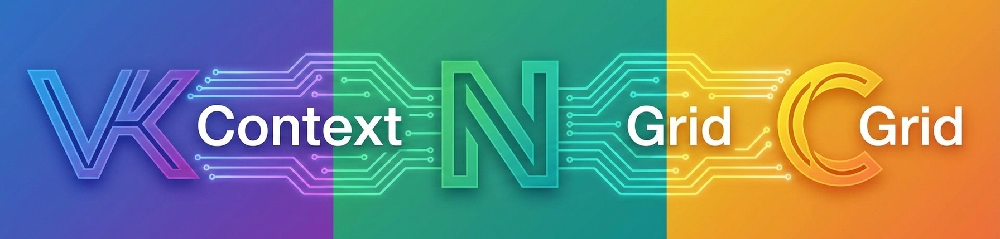
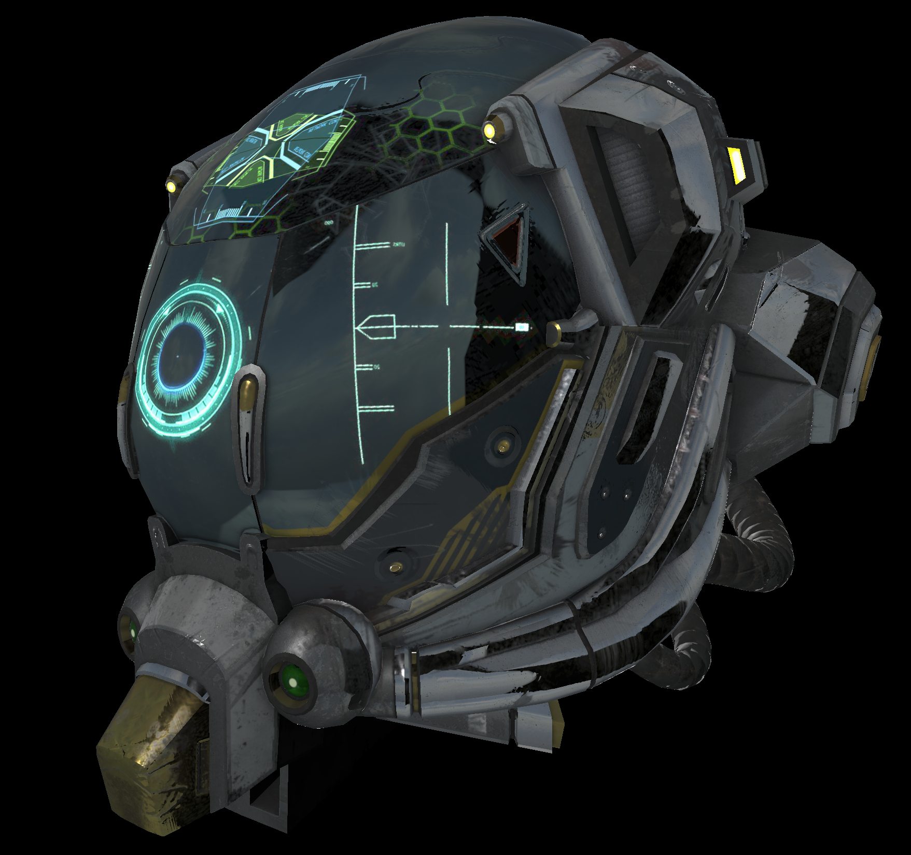
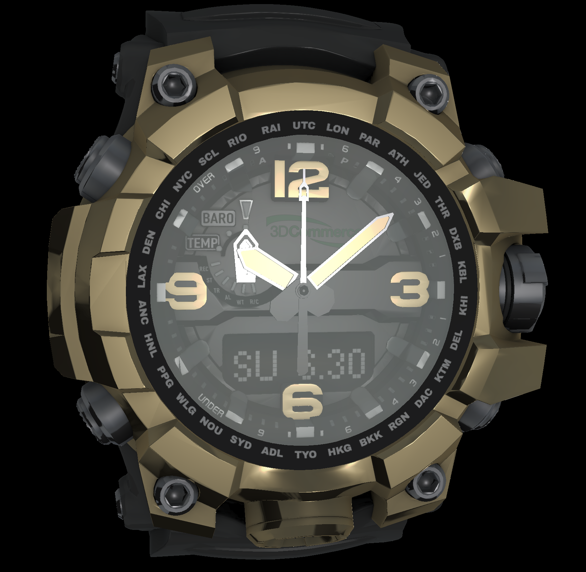

<div align="center">
  <br>
    
  <br>
  <p align="center">
    A C++ library for high-performance GPU-accelerated graphics and compute, built on Vulkan,
	<br>
	as wrapper classes for making life with Vulkan easier, reducing complex concepts to just a few lines of code.
	<br> The user decides how verbose he/she wants to be! With classes like VulkanManager, Scene, Renderer, NGrid, etc...
	<br> we can avoid the boilerplate and focus on the actual application logic. Still, everything is customizable when needed.
  </p>
  <br>
  <a href="./LICENSE">
    
  </a>
  <a href="https://github.com/cyberchriz/NGrid/pulse">
    
  </a>
  <a href="https://en.cppreference.com/w/cpp/compiler_support">
    
  </a>
</div>

---

## Quick Start
This library requires the **[VulkanSDK](https://vulkan.lunarg.com/)** and **[glslangValidator](https://github.com/KhronosGroup/glslang)** to be installed on your system.
<br>
It's recommended to build this project using CMake with the provided [`CMakeLists.txt`](CMakeLists.txt).
- CMake will automatically compile the GLSL shaders and embed them as C++ string literals into a header file (`spirv_bin.h`), which is typically located in your build directory (e.g., `../out/build/[VERSION]/generated/`).
- If you encounter issues with CMake, please ensure your environment variables are correctly configured for your operating system (Visual Studio: check CMakeSettings.json --> "CMake Variables & Cache").

---

## Core Libraries
These are the primary components for high-performance GPU computing.

| Library | Description | Status |
| :--- | :--- | :--- |
| [`vkcontext.h`](docs/vkcontext.md) | **High-level wrapper for Vulkan objects.** | 🚧 Compute tested; most Graphics features implemented + tested. |
| [`ngrid.h`](docs/ngrid.md) | **N-dimensional data structures for GPU compute.** | ✅ Tested & Feature-complete. |
| [`cgrid.h`](docs/cgrid.md) | **An extension of `NGrid` with support for complex numbers.** | ✅ Tested & Feature-complete. |

---

## Helpers / Utilities
These supporting libraries simplify development and provide additional functionality.

| Utility | Description |
| :--- | :--- |
| [`log.h`](#) | **A lightweight logging system** for debugging and information. |
| [`rnd.h`](#) | **Random number generators** for various distributions. |
| [`cdf.h`](#) | **Cumulative distribution functions** for statistical analysis. |
| [`pdf.h`](#) | **Probability density functions** for statistical analysis. |
| [`angular.h`](#) | **Angular measure conversion** for different units (radians, degrees, etc.). |
| [`vkdebug.h`](#) | **Implements capture for RenderDoc debugging** to analyze GPU workloads. |

___
## Render Example #1: "Damanged Helmet" (Khronos)
A single-material glTF 2.0 model with multiple textures (including emission), PBR shading, multiple lights, cubemap reflections, ...
<div align="center">
  <br>
    
  <br>
  <p align="center">
    example: TEST RENDER using the vkcontext.h library (<em>Source Model Credit: Khronos Group</em>)
</div>

### Code used for the example above:
```cpp
#ifndef VKCONTEXT_GRAPHICS_TEST_H
#define VKCONTEXT_GRAPHICS_TEST_H

#include <vkcontext.h>

void vkcontext_graphics_test_helmet_simplified() {

	// setup environment
	VkExtent2D extent = { 3840, 2160 };
	VulkanManager& manager = VulkanManager::get_singleton();
	Device& device = manager.get_device();
	Semaphore& tl_semaphore = manager.get_timeline_semaphore(0, VK_PIPELINE_STAGE_ALL_GRAPHICS_BIT, VK_PIPELINE_STAGE_ALL_GRAPHICS_BIT);
	Scene scene;
	Renderer rd(scene, extent);
	Surface& surface = manager.get_surface(extent.width, extent.height, "Vulkan Graphics Test - Damaged Helmet (Simplified, using Renderer class)");

	// load model
	Mesh model(device, "resources/models/gltf/DamagedHelmet2.glb", tl_semaphore, true, true); // source: Khronos Group
	
	// set scene details
	uint32_t entity_id = scene.add_entity(model, { 0.0f, 0.0f, 0.0f });
	scene.get_active_camera().set_world_up({ 0.0, 1.0, 0.0 });
	scene.get_active_camera().set_position({ 0.0f, 0.0f, 3.0f });
	scene.get_active_camera().look_at(scene.get_entity(entity_id));
	scene.get_active_camera().set_aspect_ratio(extent);
	scene.get_active_camera().set_near_plane(0.01f);
	scene.get_active_camera().set_far_plane(100.0f);
	scene.set_ambient({ 0.0f, 0.0f, 0.0f });
	scene.set_exposure(0.5f);
	scene.set_contrast(0.5f);
	scene.set_ibl_intensity(0.8f);

	// add a backfill light
	uint32_t light_id = scene.add_scene_light( LightType::DIRECTIONAL_LIGHT, { 0.0f, 0.0f, -20.0f });
	scene.get_scene_light(light_id).point_to(scene.get_entity(entity_id));
	scene.get_scene_light(light_id).set_intensity(5.0f);

	// add a front spot light
	uint32_t light_id2 = scene.add_scene_light(LightType::SPOT_LIGHT, { 5.0f, -1.5f, 5.0f });
	scene.get_scene_light(light_id2).point_to(scene.get_entity(entity_id));
	scene.get_scene_light(light_id2).set_intensity(75.0f);
	scene.get_scene_light(light_id2).set_range(20.0f);
	scene.get_scene_light(light_id2).set_cone_angle(0.8f, 1.6f);

	rd.set_surface(surface);

	// Add Event Listeners for Scroll / Translate / Rotate / WindowClose / WindowResize
	surface.add_event_listener(
		EventType::WINDOW_RESIZE,
		[&](const SurfaceEvent& e) {extent = { e.resize.width, e.resize.height }; rd.get_swapchain().update_extent(extent);	return true;}
	);
	surface.add_event_listener(
		EventType::WINDOW_CLOSE,
		[&](const SurfaceEvent& e) { rd.get_swapchain().destroy(); rd.get_surface().close(); return true; }
	);
	surface.add_event_listener(
		EventType::MOUSE_SCROLL,
		[&](const SurfaceEvent& e) { scene.get_entity(entity_id).translate({0.0f, 0.0f, 0.1f * e.scroll.yoffset}); return true; }
	);
	surface.add_event_listener(
		EventType::MOUSE_MOVE,
		[&](const SurfaceEvent& e) {
			auto& em = surface.get_event_manager();
			if (em.mouse_button_pressed(GLFW_MOUSE_BUTTON_LEFT)) {
				double dx, dy;
				em.mouse_delta(dx, dy);
				if (em.check_modifiers(GLFW_MOD_CONTROL)) {
					scene.get_entity(entity_id).translate({ static_cast<float_t>(dx * 0.001f), static_cast<float_t>(-dy * 0.001f), 0.0f });
				}
				else {
					scene.get_entity(entity_id).rotate({ static_cast<float>(dy * 0.1f), static_cast<float>(dx * 0.1f), 0.0f });
				}
				return true;
			}
			return false; // Let the event pass through if the button isn't held
		}
	);

	// main render loop
	while (!rd.get_surface().window_should_close()) {
		rd.get_surface().poll_events();
		if (rd.render_next_frame(tl_semaphore)) {
			rd.log_fps(100);
		}
	}
}
#endif

```
___
## Render Example #2: "Chronograph Watch" (Khronos)
Showcasing a complex model with many materials, PBR shading, glTF variants, transmission, cubemap reflections ...
<div align="center">
  <br>
    
  <br>
  <p align="center">
    example: TEST RENDER using the vkcontext.h library (<em>Source Model Credit: Khronos Group</em>)
</div>
---

> This repository is a work in progress.